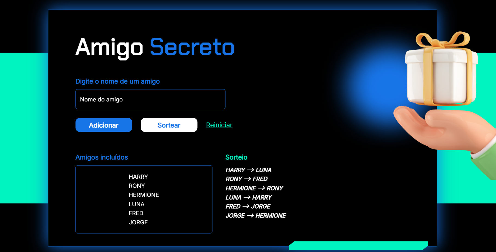

# Amigo Secreto

Projeto desenvolvido durante o curso Lógica de programação. 

### Sobre o projeto

Adicione o nome dos amigos e ao clicar em sortear os pares serão exibidos. 
Quer conhecer mais as regras de negócio? Acesse o arquivo [Epico](Epico.feature)

### Tecnologias utilizadas 

## Quer jogar ?

Acesse o [Amigo Secreto](https://sorteio-amigo-secreto-ten.vercel.app/)

## Quer aprender a desenvolver sistemas assim como eu ?

Utilize meu cupom de desconto na [Alura com 15% OFF](https://www.alura.com.br/indica-dev/priscilacaimi)
